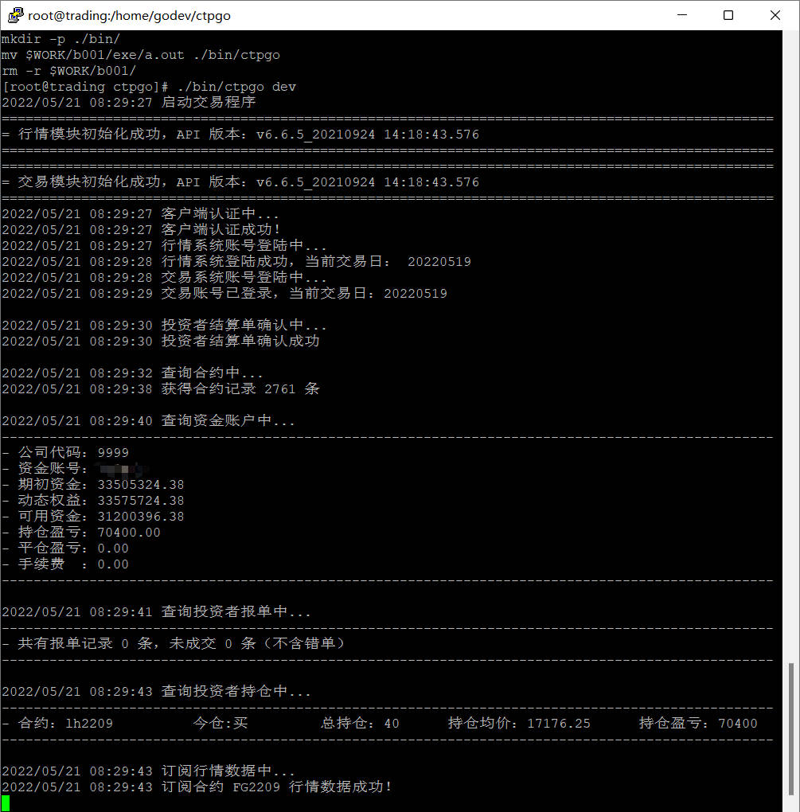

# ctpgo
[上海期货信息技术有限公司](http://www.sfit.com.cn) (由上海期货交易所投资) ctp 接口 Golang版 (for linux64)。
可连接国内四大交易所（上期所，郑商所，大商所，能源所）
接口相关资料，可参阅官方相关说明：[期货期权api](http://www.sfit.com.cn/5_2_DocumentDown_2.htm)

## 环境要求
  操作系统：Linux x86_64 (Centos, Red Hat, debian , ubuntu)  
  软件环境(将安装位置添加进PATH列表)：  
  * Go Lang (VERSION：go1.18.2）[GoLang 官网](https://go.dev) 下载[go1.18.2.linux-amd64.tar.gz](https://go.dev/dl/go1.18.2.linux-amd64.tar.gz) ，并安装;
  * CMake (VERSION: 3.20) [CMake 官网](https://cmake.org/) 下载[cmake-3.23.1-linux-x86_64.tar.gz](https://github.com/Kitware/CMake/releases/download/v3.23.1/cmake-3.23.1-linux-x86_64.tar.gz) 并安装；
  * SWIG (VERSION: 4.0.2) [SWIG 官网](https://www.swig.org/) 下载[swig-4.0.2.tar.gz](http://prdownloads.sourceforge.net/swig/swig-4.0.2.tar.gz) 并安装。  

    > linux提示符# go version

    > linux提示符# cmake -version  

    > linux提示符# swig -version  

  以上操作能正常显示各自版本，代表安装成功！  

## 实现原理
  > 第一步、 通过使用swig工具为go语言与c++（ctp 接口库和头文件是C++）进行交互，生成ctpgo_wrap.cxx、ctpgo_wrap.h、ctpgo.go文件；  

  > 第二步、 使用Cmake,将ctpgo_wrap.cxx ctpgo_wrap.h编译成 libctpgo.so文件，此文件是ctpgo.go调用CTP API的桥梁文件；  

  > 第三步、 编写Go语言程序，调用 ctpgo.go 中相关接口属性，实现调用 ctp 接口库的目的。  

    调用过程：Go -> ctpgo.go(配合libctpgo.go) -> libctpgo.so -> libthostmduserapi_se.so 和 libthosttraderapi_se.so
  
## 依赖库
    ctp Api 默认使用 gbk 编码，需要用到开源库转换为 utf8  
    go get -u github.com/axgle/mahonia

------

## 手动构建过程
### 第一步、 下载项目到本地(以/home/godev/ctpgo为例)
    git clone https://github.com/pengzuyun/ctpgo  

### 第二步、 通过swig工具，生成C++转化为C的封装和go语言项目接口文件
  这部分知识可以参考[使用swig工具为go语言与c++进行交互](https://blog.csdn.net/boshuzhang/article/details/83506370)。  

  项目目录中的sdk目录是 [期货期权api官网](http://www.sfit.com.cn/5_2_DocumentDown_2.htm) 下载的文件，对应的so库和头文件：  

    下载http://www.sfit.com.cn/DocumentDown/api_3/5_2_2/v6.6.5_tradeapi.zip包；  
    解压后复制v6.6.5_20210924_api_tradeapi_linux64.tar\v6.6.5_20210924_api\下目录，至lib目录;  
    目录改名为linux64即可。  
    
**注意1：为了匹配Go语言字符串方式，头文件有几处需要将单引号改为双引号：**  

    ThostFtdcUserApiDataType.h 2723行 至 2729行; 4609行 至 4615行

**注意2：为了使so链接库符合linux命名规则，需要在两个so文件名前添加lib：**
    
    修改后的文件名：libthosttraderapi_se.so libthostmduserapi_se.so

本项目可直接执行如下命令进行构建：
  > [提示符]# pwd
  >> /home/godev/ctpgo

  > [提示符]# cd lib
  >> /home/godev/ctpgo/lib
 
  > [提示符]# make swig  
  > 该命令调用cmake目录下 Makefile 的 swig部分，并执行(执行会报Warning 514，是因为没有构造函数的原因，不用管他)；  
  > 执行完毕，系统将生成（/home/godev/ctpgo）如下三个文件：  
  > ctpgo.go  
  > lib/linux64/ctpgo_wrap.cxx  
  > lib/linux64/ctpgo_wrap.h  

  **这些文件 会在第三步 cmake 生成 so文件中用到**

### 第三步、 通过cmake工具，将ctpgo_wrap.cxx ctpgo_wrap.h 编译成 libctpgo.so文件
  这部分知识可以[.cxx文件_我们需要懂得CMake文件](https://blog.csdn.net/weixin_39613712/article/details/110524589) 这篇文章。  

  执行如下命令进行构建：  
> [提示符]# cd cmake  
>> /home/godev/ctpgo/lib/cmake  

> [提示符]# cmake .  
>> ......  

> [提示符]# make  
>> ......  
> [提示符]# mv libctpgo.so ../linux64/libctpgo.so

执行完上述命令，将在lib目录生成 libctpgo.so，该文件可以被Go语言通过cgo模式调用。

### 第四步、 编译Go源程序，生成可执行程序
    执行如下命令进行构建(这个编译过程非常漫长，请耐心等待)：  
> [提示符]# cd /home/godev/ctpgo  
> make ctpgo 

编译完成后，将在bin目录生成ctpgo可执行文件

    执行程序：
    [提示符]# ./bin/ctpgo [test|dev|prod]  
    相关账户配置在src/ctpgo.go 105行。  

**感谢：[goctp](github.com/mayiweb/goctp) 项目提供的参考**

## 量化交易程序定制开发和国内期货开户业务

    低佣金开会，资金量大可做到交易所+1分的交易手续费，开户及程序咨询请添加XV：vip-1fen
